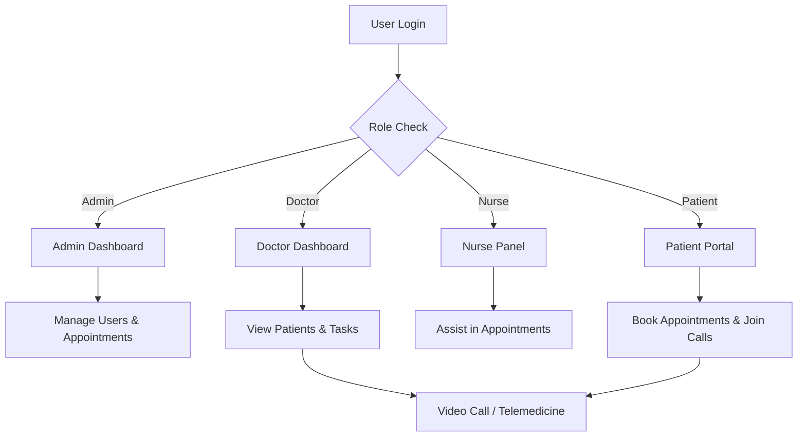

# 🏥 MedOps - Hospital Management System

MedOps is a **modern hospital management system** built using **React + TypeScript + Redux Toolkit** and **Vite**.  
It provides a seamless interface for managing appointments, patients, tasks, and telemedicine sessions across multiple user roles — **Doctors**, **Nurses**, **Patients**, and **Admins**.

---

## 🚀 Project Overview

MedOps is designed to streamline hospital operations by providing a **centralized dashboard** for scheduling, managing records, and enabling real-time video consultations.  
The frontend is fully built in React with **modular architecture**, while the backend (in earlier versions) uses **Supabase** for database, authentication, and email notifications.

---

## 🧠 Tech Stack

| Category | Technology |
|-----------|-------------|
| **Frontend Framework** | React (TypeScript + Vite) |
| **State Management** | Redux Toolkit + React Context API |
| **Styling** | CSS Modules / TailwindCSS (as applicable) |
| **Routing** | React Router |
| **Backend (planned / integrated in old repo)** | Supabase (PostgreSQL, Auth, Email APIs) |
| **Video Conferencing** | WebRTC / PeerJS Integration |
| **Authentication** | Role-Based Auth (Admin, Doctor, Nurse, Patient) |
| **Deployment** | Vercel / Netlify |

---

## 🧩 Folder Structure

```
src/
├── components/
│   ├── AppointmentCall.tsx
│   ├── AppointmentModal.tsx
│   ├── Header.tsx
│   ├── Layout.tsx
│   ├── PatientModal.tsx
│   ├── Sidebar.tsx
│   └── TaskModal.tsx
│
├── contexts/
│   ├── AuthContext.tsx
│   └── DataContext.tsx
│
├── pages/
│   ├── Appointments.tsx
│   ├── Dashboard.tsx
│   ├── Login.tsx
│   ├── Patients.tsx
│   ├── TaskBoard.tsx
│   ├── Telemedicine.tsx
│   └── VideoCall.tsx
│
├── store/
│   ├── authSlice.ts
│   ├── dataSlice.ts
│   ├── hooks.ts
│   └── store.ts
│
├── types/
├── App.tsx
├── index.css
└── main.tsx
```

---

## ⚙️ Core Features

### 👨‍⚕️ Role-Based Access
- **Admin:** Manage staff, appointments, and overall system operations.
- **Doctor:** View patient details, update records, and manage appointments.
- **Nurse:** Assist with patient records and scheduling.
- **Patient:** Schedule and track appointments, and join telemedicine calls.

### 🩺 Appointment Management
- Book, edit, and cancel appointments.
- Real-time updates via state management (Redux).
- View appointment history.

### 💬 Telemedicine & Video Calls
- Real-time consultations using **WebRTC**.
- Secure peer-to-peer video connections.

### 🧾 Task Board
- Doctors and nurses can manage hospital tasks collaboratively.

### 🧠 Centralized Data Layer
- Redux Toolkit and Context API for smooth data flow.
- Optimized for scalability and maintainability.

### 🔔 Notification System *(Old Backend)*
- Email notifications for appointment confirmation and updates (via Supabase).

---

## 🧭 Application Workflow



---


## 🛠️ Installation & Setup

```bash
# Clone the repo
git clone https://github.com/lokaesshwar/med-ops.git

# Navigate to project folder
cd med-ops

# Install dependencies
npm install

# Run the app
npm run dev
```

Then open [http://localhost:5173](http://localhost:5173).


## 📜 License

This project is licensed under the **MIT License** — feel free to use and modify.

---

> ⚡ *MedOps — Empowering digital healthcare management through modern web technologies.*
